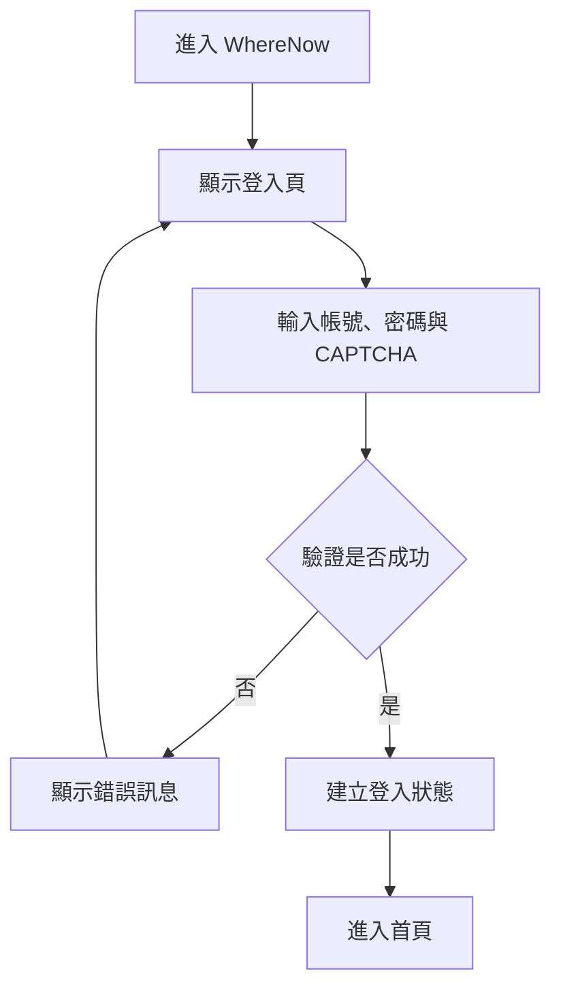
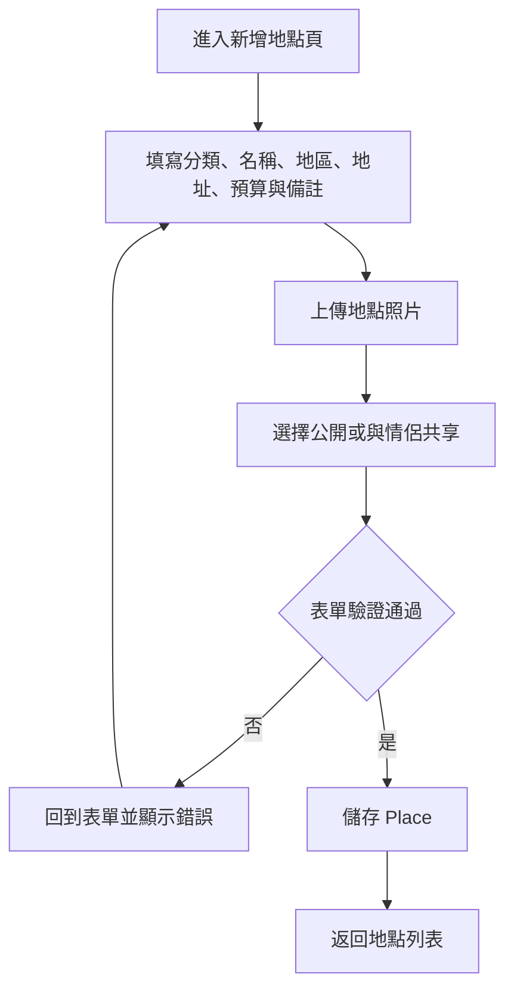
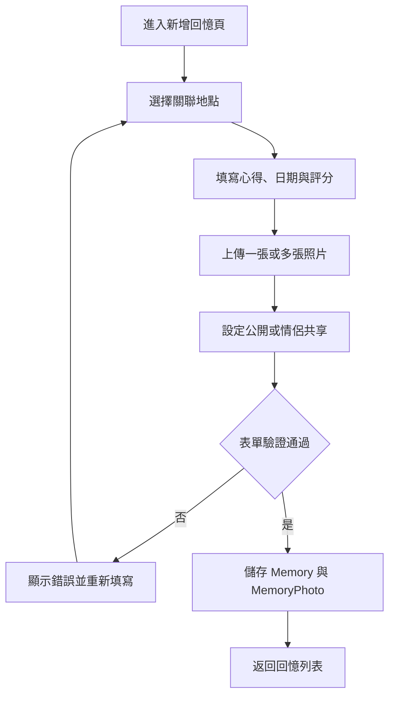
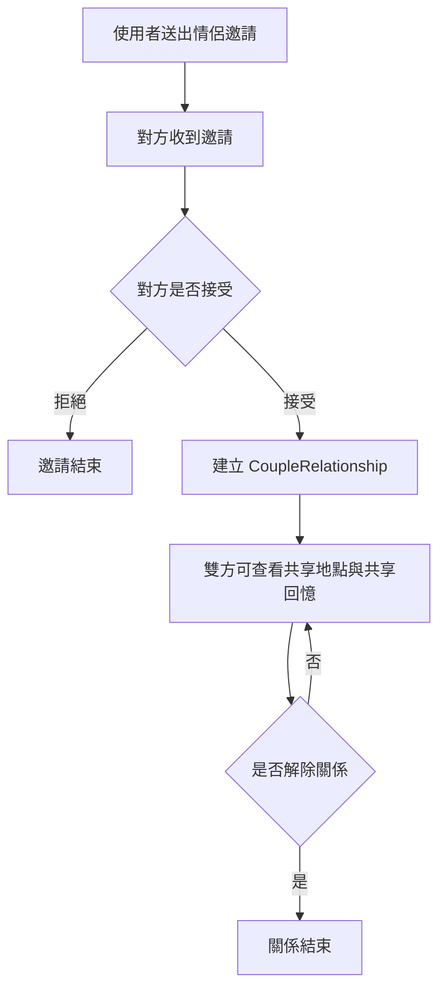
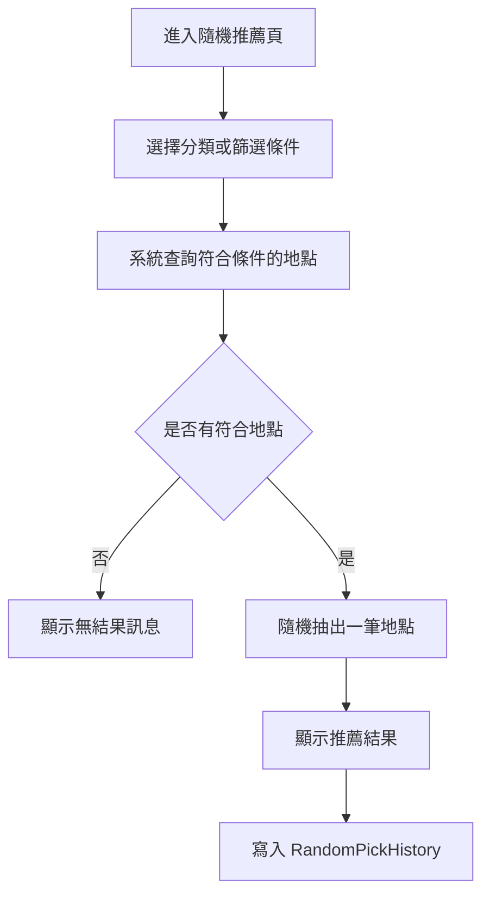

# WhereNow Activity Diagram

本文件補充 WhereNow 的主要活動流程，協助說明使用者如何從登入、管理地點、建立回憶，到使用情侶共享與隨機推薦功能。

## 1. 使用者登入與進入首頁

流程說明：

1. 使用者開啟系統時，若尚未登入會導向登入頁。
2. 登入頁提供帳號密碼與 CAPTCHA 驗證。
3. 驗證成功後進入首頁，驗證失敗則回到登入頁並提示錯誤。

## 2. 新增地點流程

流程說明：

1. 使用者可建立地點並選擇分類。
2. 可設定地點是否公開，或是否與另一半共享。
3. 系統驗證成功後將資料寫入資料庫。

## 3. 新增回憶流程

流程說明：

1. 回憶需連結到一個既有地點。
2. 使用者可補充心得、照片與分享設定。
3. 系統會同時儲存回憶主資料與照片資料。

## 4. 情侶邀請與共享流程

流程說明：

1. 使用者可邀請另一位使用者建立情侶關係。
2. 成功建立關係後，雙方可看到標記為共享的地點與回憶。
3. 使用者可解除關係。

## 5. 隨機推薦流程

流程說明：

1. 使用者可依分類或條件進行抽選。
2. 若查無地點，系統提示無結果。
3. 若成功抽出地點，系統會保留抽選紀錄。
