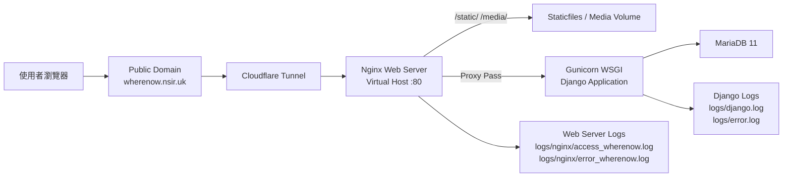
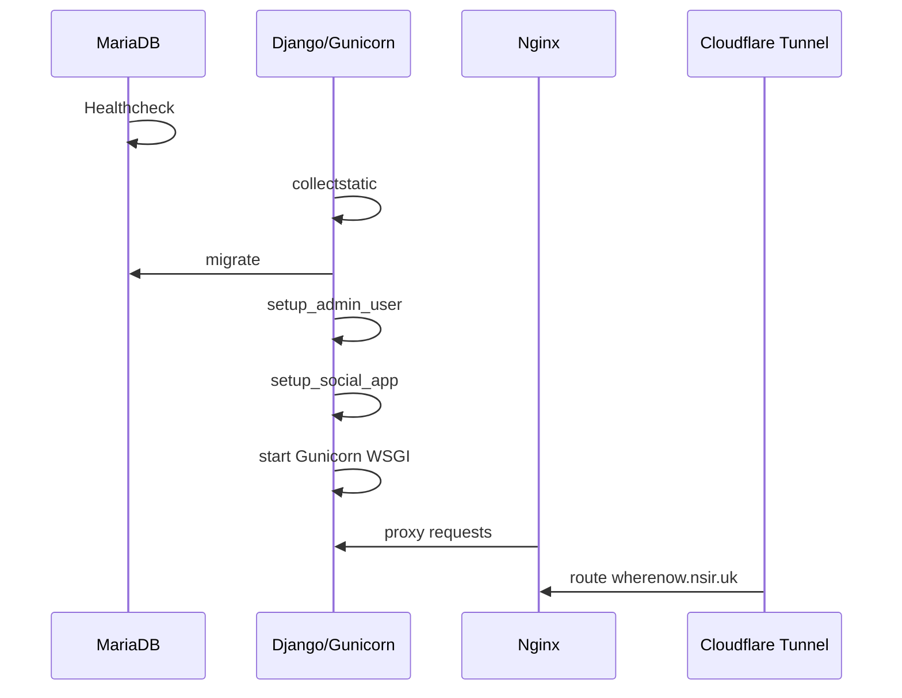

# WhereNow Deployment Diagram

WhereNow 部署在 Linux Docker 環境中，使用 Nginx 作為 Web Server 與 Virtual Host，並透過 Gunicorn WSGI 執行 Django Application。資料庫採用 MariaDB，公開網域由 Cloudflare Tunnel 導入 Nginx。

## 1. 系統架構圖



## 2. 部署元件說明

| 元件 | 技術 | 說明 |
|---|---|---|
| Linux OS | Docker Linux containers | 所有服務皆執行於 Linux container。 |
| Web Server | Nginx | 提供 Virtual Host、靜態檔服務、媒體檔服務與反向代理。 |
| WSGI Server | Gunicorn | 執行 `wherenow.wsgi:application`。 |
| Django Application | Django | 提供 Web UI、DRF API、i18n、logging、JWT 與 CAPTCHA。 |
| Database | MariaDB 11 | 取代 SQLite 作為正式資料庫。 |
| Public Access | Cloudflare Tunnel | 將 `https://wherenow.nsir.uk` 導向內部 Nginx。 |
| Logs | Django logging / Nginx logs | 後端事件與 Web Server request/error 皆落地於 `logs/`。 |

## 3. Docker 服務對照

| Service | Container | Port | 功能 |
|---|---|---|---|
| `db` | `wherenow-db` | 3306 internal | MariaDB 資料庫。 |
| `web` | `wherenow-web` | 8000 internal | Django + Gunicorn WSGI。 |
| `nginx` | `wherenow-nginx` | host `8080` -> container `80` | Web Server、Virtual Host、reverse proxy。 |
| `cloudflared` | `wherenow-tunnel` | outbound tunnel | 公開網域連線入口。 |

## 4. Virtual Host 設定

Virtual Host 設定檔位於：

```text
nginx/conf.d/wherenow.conf
```

主要設定：

1. `server_name wherenow.nsir.uk localhost 127.0.0.1`
2. `/static/` 指向 `/app/staticfiles/`
3. `/media/` 指向 `/app/media/`
4. 其他請求透過 `proxy_pass http://web:8000` 交給 Gunicorn WSGI
5. Access log 寫入 `/var/log/nginx/access_wherenow.log`
6. Error log 寫入 `/var/log/nginx/error_wherenow.log`

## 5. Log 規劃

| 類型 | 檔案 | 用途 |
|---|---|---|
| Django application log | `logs/django.log` | 記錄 Django 一般事件。 |
| Django error log | `logs/error.log` | 記錄 Django 錯誤事件。 |
| Nginx access log | `logs/nginx/access_wherenow.log` | 記錄 HTTP request。 |
| Nginx error log | `logs/nginx/error_wherenow.log` | 記錄 Web Server 錯誤。 |

## 6. 啟動流程


