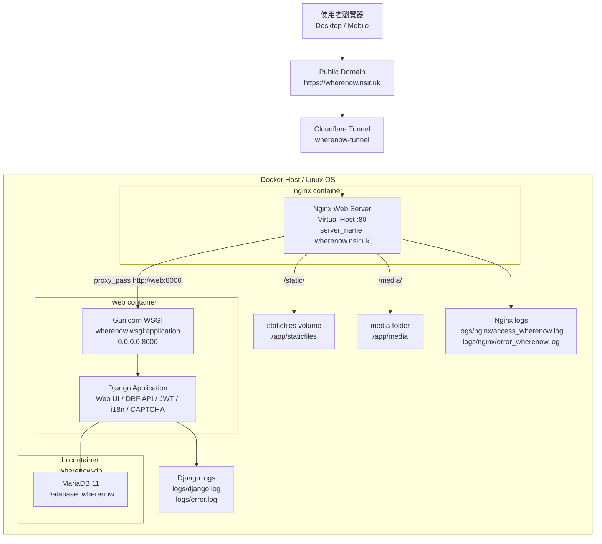
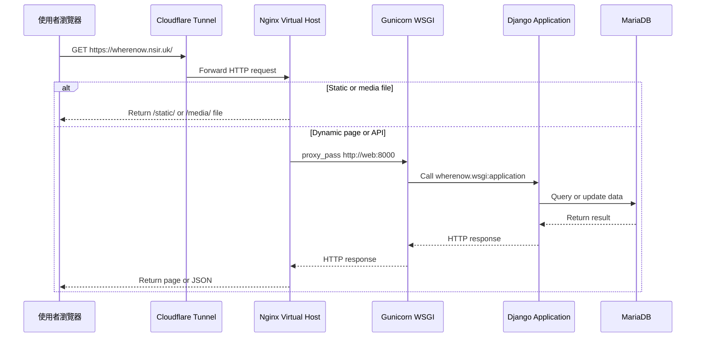

# WhereNow Deployment Diagram

WhereNow 目前部署在 Docker Linux containers 中，使用 Nginx 作為 Web Server 與 Virtual Host，Nginx 再反向代理到 Gunicorn WSGI 執行的 Django Application。資料庫使用 MariaDB 11，公開網域透過 Cloudflare Tunnel 導向 Nginx。

## 1. Deployment Diagram / 系統架構圖



## 2. 部署元件對照

| 層級 | 元件 | 對應設定 | 說明 |
|---|---|---|---|
| Public Access | Cloudflare Tunnel | `.cloudflared/config.yml` | 將 `wherenow.nsir.uk` 導向 Docker 內的 Nginx。 |
| Web Server | Nginx | `nginx/conf.d/wherenow.conf` | 提供 Virtual Host、靜態檔服務、媒體檔服務與 reverse proxy。 |
| WSGI Server | Gunicorn | `docker-compose.yml` command | 執行 `wherenow.wsgi:application`。 |
| Application | Django | `wherenow/settings.py` | 提供 Web UI、DRF API、JWT、i18n、CAPTCHA 與 logging。 |
| Database | MariaDB 11 | `docker-compose.yml` service `db` | 正式資料庫，取代 SQLite。 |
| Static files | Docker volume `staticfiles` | `/app/staticfiles` | 由 `collectstatic` 產生，再由 Nginx 提供。 |
| Media files | Local folder `media` | `/app/media` | 儲存使用者上傳的頭像、地點照片與回憶照片。 |
| Logs | Local folder `logs` | `/app/logs`、`/var/log/nginx` | 保存 Django 與 Nginx 日誌。 |

## 3. Docker Services

| Service | Container | Image / Runtime | Port | 功能 |
|---|---|---|---|---|
| `db` | `wherenow-db` | `mariadb:11` | internal `3306` | MariaDB 資料庫。 |
| `web` | `wherenow-web` | Python + Django + Gunicorn | host `8000` -> container `8000` | Django Application 與 WSGI server。 |
| `nginx` | `wherenow-nginx` | `nginx:1.27-alpine` | host `8080` -> container `80` | Web Server、Virtual Host、Reverse Proxy。 |
| `cloudflared` | `wherenow-tunnel` | `cloudflare/cloudflared` | outbound tunnel | 將公開網域流量導入 Nginx。 |

## 4. Request Flow



## 5. 啟動流程

`web` container 啟動時會依序執行：

1. 建立 `/app/logs` 與 `/app/data`。
2. 執行 `python manage.py collectstatic --noinput`。
3. 執行 `python manage.py migrate --noinput`。
4. 執行 `python manage.py setup_admin_user`，依 `.env` 建立預設 admin。
5. 執行 `python manage.py setup_social_app`，建立 Google OAuth Site / SocialApp 設定。
6. 啟動 `gunicorn wherenow.wsgi:application --bind 0.0.0.0:8000 --workers 4`。

## 6. Virtual Host 設定摘要

設定檔：

```text
nginx/conf.d/wherenow.conf
```

重點設定：

| 設定 | 說明 |
|---|---|
| `listen 80` | Nginx container 內監聽 HTTP 80。 |
| `server_name wherenow.nsir.uk localhost 127.0.0.1` | Virtual Host domain。 |
| `location /static/` | 指向 `/app/staticfiles/`。 |
| `location /media/` | 指向 `/app/media/`。 |
| `proxy_pass http://web:8000` | 將 Django 動態請求交給 Gunicorn WSGI。 |
| `access_log /var/log/nginx/access_wherenow.log` | Web Server access log。 |
| `error_log /var/log/nginx/error_wherenow.log warn` | Web Server error log。 |

## 7. Log 檔案

| 類型 | 檔案 |
|---|---|
| Django application log | `logs/django.log` |
| Django error log | `logs/error.log` |
| Nginx access log | `logs/nginx/access_wherenow.log` |
| Nginx error log | `logs/nginx/error_wherenow.log` |
