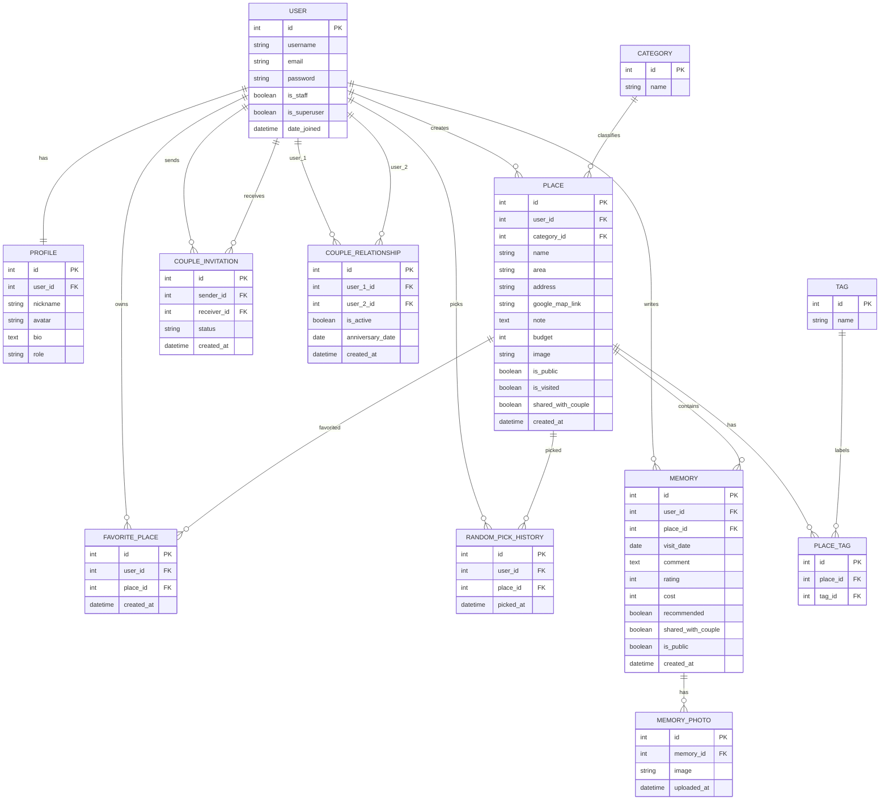

# WhereNow ERD

本文件依照目前 Django Models 整理 WhereNow 的最新資料模型。系統核心資料包含 Django Auth User、Profile、地點、分類、標籤、收藏、隨機推薦紀錄、回憶、回憶照片、情侶邀請與情侶關係。

## 1. ERD Diagram

## 2. Entity 說明

| Entity | 對應 Model | 說明 |
|---|---|---|
| User | `django.contrib.auth.models.User` | Django 內建使用者資料，負責帳號、密碼、權限與後台登入。 |
| Profile | `users.Profile` | 使用者延伸資料，包含暱稱、頭像、個人簡介與角色。 |
| Category | `places.Category` | 地點分類，例如餐廳、景點、咖啡廳等。 |
| Tag | `places.Tag` | 地點標籤，可讓地點有多個描述標籤。 |
| Place | `places.Place` | 地點主資料，包含地區、地址、預算、照片、公開與共享設定。 |
| PlaceTag | `places.PlaceTag` | Place 與 Tag 的多對多中介表。 |
| FavoritePlace | `places.FavoritePlace` | 使用者收藏地點紀錄，同一使用者與地點不可重複收藏。 |
| RandomPickHistory | `places.RandomPickHistory` | 使用者執行隨機推薦後留下的抽選紀錄。 |
| Memory | `memories.Memory` | 使用者對某個地點建立的回憶，包含日期、心得、評分、花費與公開設定。 |
| MemoryPhoto | `memories.MemoryPhoto` | 回憶照片，一筆回憶可包含多張照片。 |
| CoupleInvitation | `couples.CoupleInvitation` | 情侶邀請紀錄，狀態包含 pending、accepted、rejected。 |
| CoupleRelationship | `couples.CoupleRelationship` | 已建立的情侶關係，包含是否啟用與紀念日。 |

## 3. Relationship 說明

| 關聯 | 類型 | 說明 |
|---|---|---|
| User - Profile | 一對一 | 每位使用者自動建立一筆 Profile。 |
| User - Place | 一對多 | 使用者可建立多筆地點。 |
| Category - Place | 一對多 | 一個分類可對應多筆地點；地點分類可為空。 |
| Place - Tag | 多對多 | 透過 PlaceTag 建立地點與標籤的多對多關係。 |
| User - FavoritePlace - Place | 多對多中介 | 使用者可收藏多個地點，地點也可被多位使用者收藏。 |
| User - RandomPickHistory - Place | 一對多中介 | 使用者每次隨機推薦會產生一筆抽選紀錄。 |
| User - Memory | 一對多 | 使用者可建立多筆回憶。 |
| Place - Memory | 一對多 | 一個地點可被多筆回憶引用。 |
| Memory - MemoryPhoto | 一對多 | 一筆回憶可上傳多張照片。 |
| User - CoupleInvitation | 一對多 | 使用者可送出或接收多筆情侶邀請。 |
| User - CoupleRelationship | 一對多 | 情侶關係由兩位 User 組成。 |

## 4. 重要約束

| Model | 約束 |
|---|---|
| `PlaceTag` | `unique_together = ('place', 'tag')`，避免同一地點重複套用同一標籤。 |
| `FavoritePlace` | `unique_together = ('user', 'place')`，避免同一使用者重複收藏同一地點。 |
| `Memory.rating` | 評分限制為 0 到 5。 |
| `CoupleInvitation.status` | 狀態限制為 pending、accepted、rejected。 |
