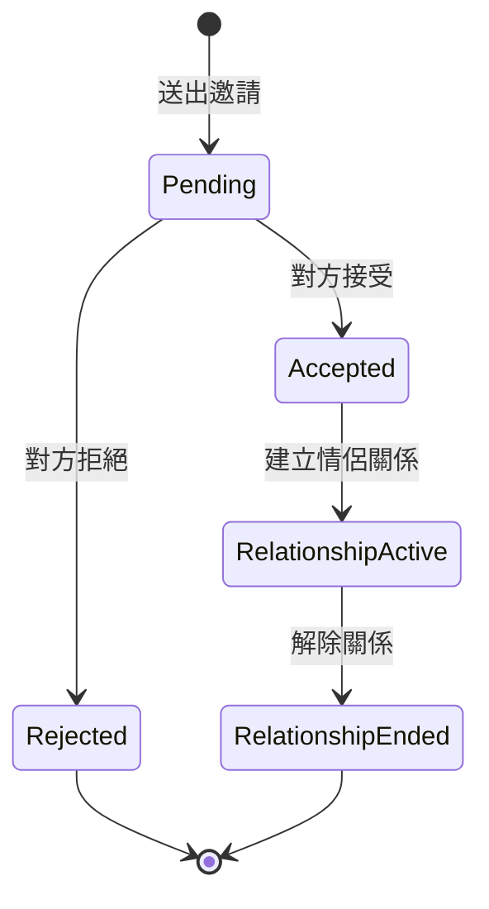
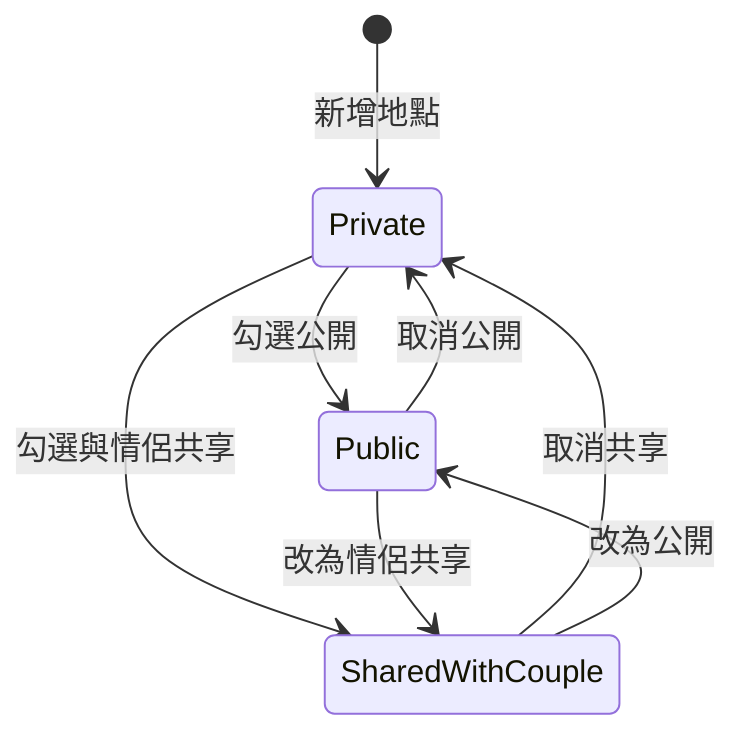
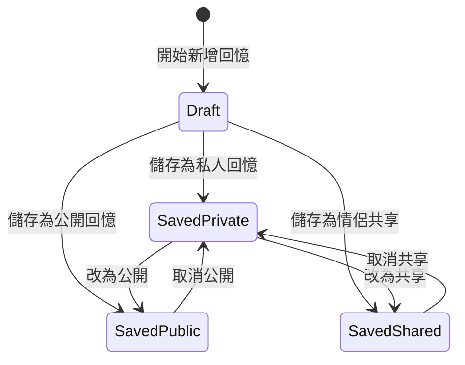
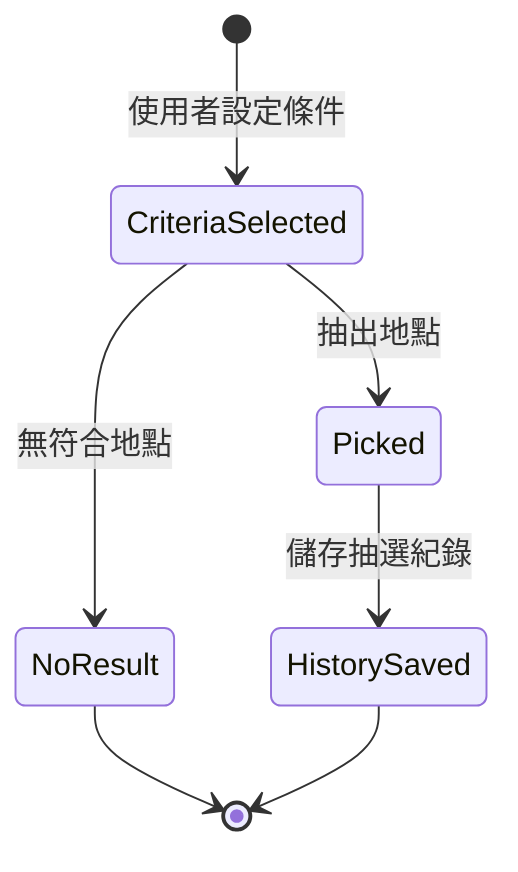

# WhereNow State Diagram

本文件補充 WhereNow 中需要特別說明的狀態變化，主要包含情侶邀請流程、地點公開狀態、回憶公開狀態與隨機推薦紀錄。

## 1. 情侶邀請狀態

情侶邀請由一位使用者送出，另一位使用者可接受或拒絕。接受後會建立 CoupleRelationship，拒絕則結束該邀請流程。

| 狀態 | 說明 |
|---|---|
| Pending | 邀請已送出，等待對方回覆。 |
| Accepted | 對方接受邀請，系統準備建立關係。 |
| Rejected | 對方拒絕邀請，邀請流程結束。 |
| RelationshipActive | 雙方已建立情侶關係，可共享地點與回憶。 |
| RelationshipEnded | 使用者解除情侶關係。 |

## 2. 地點可見狀態

地點可依使用者設定分為私人、公開，以及與另一半共享。

| 狀態 | 說明 |
|---|---|
| Private | 只有建立者可以瀏覽與管理。 |
| Public | 所有登入使用者可於探索頁瀏覽。 |
| SharedWithCouple | 建立者與另一半可瀏覽。 |

## 3. 回憶可見狀態

回憶的公開狀態與地點類似，但回憶通常會連結到一個地點與多張照片。

| 狀態 | 說明 |
|---|---|
| Draft | 使用者正在填寫回憶資料，尚未送出。 |
| SavedPrivate | 已儲存，僅建立者可看。 |
| SavedPublic | 已儲存，公開於探索頁。 |
| SavedShared | 已儲存，建立者與另一半可看。 |

## 4. 隨機推薦紀錄狀態

隨機推薦會從符合條件的地點中抽出一筆，並保留抽選紀錄，方便使用者回顧。

| 狀態 | 說明 |
|---|---|
| CriteriaSelected | 使用者選擇分類、預算或其他條件。 |
| NoResult | 查無符合條件的地點。 |
| Picked | 系統抽出推薦地點。 |
| HistorySaved | 系統寫入 RandomPickHistory。 |
