# WhereNow Use Case Diagram

WhereNow 是一套以「地點紀錄、回憶保存、情侶共享、探索推薦」為核心的 Django Web Application。系統提供一般使用者記錄地點與回憶，也提供情侶使用者共享資料，管理者則可透過 Django Admin 維護基礎資料與使用者資料。

## 1. Actors

| Actor | 說明 |
|---|---|
| Visitor | 尚未登入的訪客，可註冊、登入、切換語言與通過 CAPTCHA 驗證。 |
| User | 一般登入使用者，可管理自己的地點、回憶、收藏與隨機推薦紀錄。 |
| Couple User | 已建立情侶關係的使用者，可查看與另一半共享的地點與回憶。 |
| Admin | 系統管理者，可進入 Django Admin 管理使用者、分類、地點、回憶與系統資料。 |
| External Client | 外部系統或 API 使用者，可透過 JWT 呼叫 DRF REST API。 |

## 2. Use Case Diagram

```mermaid
flowchart LR
    Visitor["Visitor\n訪客"]
    User["User\n一般使用者"]
    Couple["Couple User\n情侶使用者"]
    Admin["Admin\n管理者"]
    Client["External Client\n外部 API 呼叫端"]

    subgraph AUTH["帳號與認證"]
        UC_Register["註冊帳號"]
        UC_Login["登入系統"]
        UC_Captcha["輸入 / 更新 CAPTCHA"]
        UC_Language["切換中英文介面"]
        UC_Profile["檢視與編輯個人資料"]
    end

    subgraph PLACE["地點管理"]
        UC_PlaceList["查看我的地點"]
        UC_PlaceCreate["新增地點"]
        UC_PlaceEdit["編輯 / 刪除地點"]
        UC_Category["依分類管理地點"]
        UC_Favorite["收藏 / 取消收藏地點"]
        UC_RandomPick["隨機推薦地點"]
        UC_RandomHistory["查看抽獎紀錄"]
    end

    subgraph MEMORY["回憶管理"]
        UC_MemoryList["查看我的回憶"]
        UC_MemoryCreate["新增回憶"]
        UC_MemoryEdit["編輯 / 刪除回憶"]
        UC_Photo["上傳 / 刪除回憶照片"]
        UC_PublicSearch["搜尋公開回憶"]
    end

    subgraph COUPLE["情侶共享"]
        UC_SendInvite["送出情侶邀請"]
        UC_ReplyInvite["接受 / 拒絕邀請"]
        UC_CoupleHome["查看情侶首頁"]
        UC_SharedPlaces["查看共享地點"]
        UC_SharedMemories["查看共享回憶"]
        UC_Anniversary["設定紀念日"]
        UC_BreakUp["解除情侶關係"]
    end

    subgraph ADMIN["後台管理"]
        UC_AdminUsers["管理使用者與角色"]
        UC_AdminCategories["管理地點分類"]
        UC_AdminContent["管理地點、回憶與情侶資料"]
    end

    subgraph API["REST API"]
        UC_Token["取得 / 更新 JWT Token"]
        UC_APIPlaces["呼叫 Places API"]
        UC_APIMemories["呼叫 Memories API"]
        UC_APICouples["呼叫 Couples API"]
        UC_APIProfiles["呼叫 Profiles API"]
        UC_APIDocs["查看 Swagger / ReDoc 文件"]
    end

    Visitor --> UC_Register
    Visitor --> UC_Login
    Visitor --> UC_Captcha
    Visitor --> UC_Language

    User --> UC_Profile
    User --> UC_PlaceList
    User --> UC_PlaceCreate
    User --> UC_PlaceEdit
    User --> UC_Category
    User --> UC_Favorite
    User --> UC_RandomPick
    User --> UC_RandomHistory
    User --> UC_MemoryList
    User --> UC_MemoryCreate
    User --> UC_MemoryEdit
    User --> UC_Photo
    User --> UC_PublicSearch
    User --> UC_SendInvite
    User --> UC_ReplyInvite

    Couple --> UC_CoupleHome
    Couple --> UC_SharedPlaces
    Couple --> UC_SharedMemories
    Couple --> UC_Anniversary
    Couple --> UC_BreakUp

    Admin --> UC_AdminUsers
    Admin --> UC_AdminCategories
    Admin --> UC_AdminContent
    Admin --> UC_APIDocs

    Client --> UC_Token
    Client --> UC_APIPlaces
    Client --> UC_APIMemories
    Client --> UC_APICouples
    Client --> UC_APIProfiles
    Client --> UC_APIDocs
```

## 3. 主要 Use Case 說明

| Use Case | Actor | 說明 |
|---|---|---|
| 註冊帳號 | Visitor | 建立 WhereNow 帳號，系統自動建立 Profile。 |
| 登入系統 | Visitor | 使用帳號密碼登入，登入頁包含 CAPTCHA 驗證。 |
| 切換中英文介面 | Visitor / User | 透過 Django i18n 切換中文與英文頁面語系。 |
| 新增地點 | User | 建立地點資料，包含分類、地區、地址、Google 地圖連結、預算、照片、公開與共享設定。 |
| 收藏地點 | User | 將喜歡的地點加入收藏清單，或從收藏中移除。 |
| 隨機推薦地點 | User | 依條件隨機抽出地點，並寫入 RandomPickHistory。 |
| 新增回憶 | User | 將回憶連結到地點，記錄日期、心得、評分、花費、推薦與公開設定。 |
| 上傳回憶照片 | User | 為回憶新增一張或多張照片。 |
| 情侶邀請 | User | 送出、接受或拒絕情侶邀請，接受後建立 CoupleRelationship。 |
| 共享地點與回憶 | Couple User | 查看另一半共享的地點與回憶。 |
| 後台管理 | Admin | 管理使用者、Profile、分類、地點、回憶與情侶資料。 |
| REST API 呼叫 | External Client | 透過 JWT Token 呼叫 DRF API。 |
